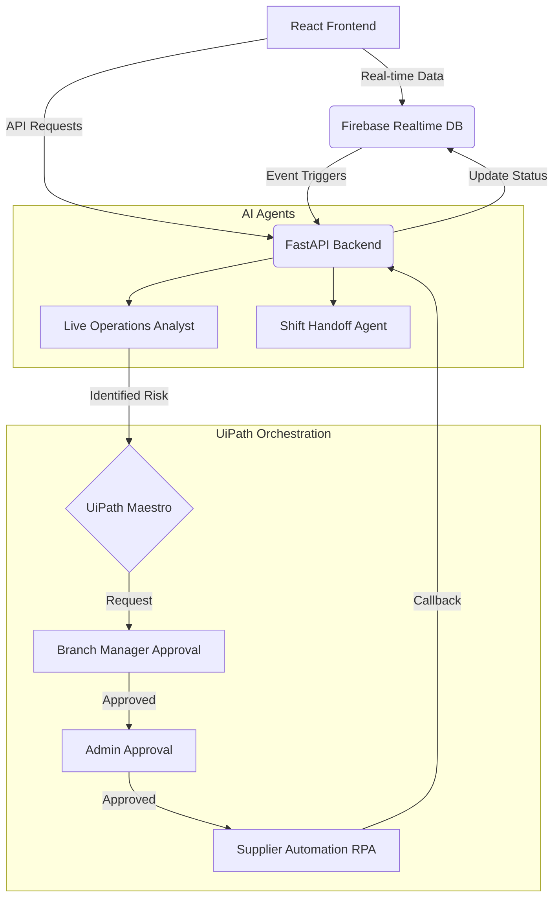

# Fitzschh AI - Automated Restaurant Operations

This repository contains the source code for an AI-powered, proactive restaurant operations platform built for the **UiPath Hackathon**. 

---

## Overview

Traditional Point-of-Sale (POS) and inventory systems are fundamentally **reactive**. They wait for human operators to input data, check stock levels, and manually identify operational bottlenecks. This results in delayed responses to critical inventory shortages and operational inefficiencies.

**Fitzschh AI** flips this paradigm by offering a **proactive** monitoring and automation platform. By deeply integrating **OpenAI agents** with **UiPath Maestro**, the system continuously monitors real-time sales streams, dynamically predicts inventory depletion, generates actionable recommendations, and orchestrates automated supplier restocks—all before a human even realizes there is a problem.

---

## Features

- **AI Live Operations Analyst**: Continuously analyzes sales velocity and stock levels to proactively detect risks.
- **AI Shift Handoff**: Generates intelligent shift summaries and context handoffs for managerial continuity.
- **Inventory Management**: Real-time tracking with unit normalization and predictive depletion alerts.
- **Menu Management**: Dynamic menu synchronization with inventory availability.
- **Analytics Dashboard**: Multi-branch KPI visualization and performance comparisons.
- **Notifications & Inbox Feed**: Centralized, role-based event streaming and alerting.
- **Branch Management**: Granular control over multiple restaurant locations.
- **Mobile Responsive Interface**: Fully optimized for tablet and mobile POS deployments.
- **Human-in-the-Loop (HITL) Approval Workflow**: Two-tier approval system ensuring oversight before automation execution.
- **Automated Supplier Workflow**: Seamless integration with UiPath to execute robotic supplier restocks.
- **Firebase Integration**: Real-time NoSQL database and secure authentication.
- **OpenAI Integration**: Advanced GPT-4o-mini reasoning for operational intelligence.
- **UiPath Maestro Integration**: Orchestration of complex, multi-agent workflows.

---

## System Architecture

The platform employs an event-driven, multi-agent architecture:



---

## AI Components

The platform utilizes specialized AI agents to handle distinct operational domains.

### AI Live Operations Analyst
- **Purpose**: To act as an ever-watchful digital assistant that anticipates problems before they impact customers.
- **Inputs**: Real-time sales logs, current inventory levels, category velocities, and historical trends.
- **Outputs**: Actionable operational alerts, severity ratings, and concrete action plans.
- **Responsibilities**: Continuous risk detection (e.g., "Medium cups will run out in 1.2 hours"), generating restock recommendations, and seeding automated workflows.

### AI Shift Handoff
- **Purpose**: To ensure operational continuity between changing managerial shifts.
- **Inputs**: Aggregated shift logs, resolved issues, and outstanding workflow approvals.
- **Outputs**: A concise, professional handoff report.
- **Responsibilities**: Context transfer, highlighting critical pending actions, and summarizing shift performance.

---

## UiPath Workflow

The core automation pipeline is driven by **UiPath Maestro**, facilitating a robust Human-in-the-Loop (HITL) architecture.

### Orchestration Lifecycle
1. **Risk Detection**: The AI Analyst identifies a critical stock depletion and generates an Action Plan.
2. **Branch Manager Review**: The workflow halts, requiring the local Branch Manager to review and approve the AI's proposed action plan.
3. **Admin Approval**: For actions exceeding a certain threshold, a secondary Admin/Owner approval is mandated.
4. **Supplier RPA**: Once fully approved, UiPath Maestro triggers an unattended Robot (RPA) to interface with the external supplier's ordering portal.
5. **Callback Mechanism**: Upon successful order placement, the Robot fires a secure callback to the FastAPI backend.
6. **Inventory Update**: The backend automatically increments the local inventory to reflect the inbound stock, refreshing the analytics dashboard in real-time.

> **Note on Simulation Mode**: For demonstration and local development purposes, the backend includes a Simulation Mode. If UiPath credentials are not provided, the backend will simulate the orchestration delay and automatically fire the successful callback, preserving the exact production architectural flow without requiring a live Orchestrator tenant.

---

## User Roles

The platform enforces strict Role-Based Access Control (RBAC).

### Admin
- **Responsibilities**: Oversees multi-branch operations, global supplier configurations, and executive approvals.
- **Permissions**: Full read/write access across all branches, ability to manage users, and final authority on high-impact workflows.
- **Available Modules**: Executive Dashboard, Global Analytics, Cross-Branch Approvals, Global Menu Settings.

### Branch Manager
- **Responsibilities**: Manages day-to-day operations of a single assigned branch.
- **Permissions**: Read/write access strictly scoped to their branch.
- **Available Modules**: Branch Dashboard, Local Inventory, Local Menu Toggles, Level-1 Approvals.

---

## Technology Stack

- **React**, **TypeScript**, **Vite**, **Tailwind CSS**, **Recharts**
- **FastAPI**, **Python**, **Pydantic**, **Uvicorn**
- **Firebase Realtime Database**, **Firebase Authentication**
- **OpenAI API**
- **UiPath Maestro**, **UiPath Orchestrator**

---

## Project Structure

```text
.
├── backend/                  # FastAPI Backend Server
│   ├── ai_analysis.py        # OpenAI Agent Integrations
│   ├── main.py               # API Routing & App Entrypoint
│   ├── uipath_client.py      # UiPath API / Orchestrator Client
│   └── workflow_engine.py    # HITL Workflow State Machine
├── functions/                # Legacy/Auxiliary Firebase Cloud Functions
├── public/                   # Static Frontend Assets
├── src/                      # React Frontend Source
│   ├── components/           # Reusable UI Components & Dashboard Widgets
│   ├── config/               # App Configurations (Auth, Roles)
│   ├── context/              # React Context (Auth State)
│   ├── hooks/                # Custom React Hooks
│   ├── lib/                  # Core API Wrappers (Firebase, Analytics, AI)
│   └── pages/                # Route-level Page Components
├── .env.example              # Example Environment Variables
├── firebase.json             # Firebase Hosting/Rules Config
└── package.json              # NPM Dependencies
```

---

## Installation

### 1. Clone the Repository
```bash
git clone https://github.com/your-org/AI-automated-restaurant-operations.git
cd AI-automated-restaurant-operations
```

### 2. Frontend Installation
```bash
# Install NPM dependencies
npm install
```

### 3. Backend Installation
```bash
cd backend
# Create a virtual environment
python -m venv venv
source venv/bin/activate  # On Windows: venv\Scripts\activate

# Install Python dependencies
pip install -r requirements.txt
```

### 4. Environment Configuration
Copy the `.env.example` file to create your local `.env`:
```bash
cp .env.example .env
```
Populate the `.env` file with your specific credentials (see Environment Variables section below).

### 5. Running the Application
**Start the Backend (Terminal 1):**
```bash
cd backend
source venv/bin/activate
uvicorn main:app --reload --port 8080
```

**Start the Frontend (Terminal 2):**
```bash
# In the repository root
npm run dev
```

---

## Environment Variables

The application relies on several environment variables. **Never commit actual secrets to version control.**

| Variable | Purpose | Required? |
|----------|---------|-----------|
| `OPENAI_API_KEY` | Authenticates backend requests to the OpenAI API for the Analyst and Handoff agents. | Yes |
| `OPENAI_MODEL` | The specific model to use (default: `gpt-4o-mini`). | No |
| `VITE_FIREBASE_API_KEY` | Public API key for Firebase initialization in the frontend. | Yes |
| `VITE_FIREBASE_PROJECT_ID`| The specific Firebase project ID. | Yes |
| `VITE_FIREBASE_DATABASE_URL`| The Realtime Database instance URL. | Yes |
| `VITE_EVENT_GATEWAY_URL` | The URL pointing to the running FastAPI backend (e.g., `http://localhost:8080`). | Yes |
| `UIPATH_CLOUD_URL` | Base URL for UiPath Cloud (e.g., `https://cloud.uipath.com`). | For Production |
| `UIPATH_CLIENT_ID` | OAuth Client ID for authenticating with UiPath Orchestrator. | For Production |
| `UIPATH_CLIENT_SECRET` | OAuth Client Secret for authenticating with UiPath Orchestrator. | For Production |

---

## Running the Project

### Demo / Simulation Mode
If you run the backend without providing the `UIPATH_*` environment variables, the system automatically falls back to **Simulation Mode**. 
In this mode, the UI and API behave exactly as they would in production. When a workflow reaches the `APPROVED` state, the backend will wait a few seconds and simulate a successful UiPath callback, allowing you to demonstrate the full architectural loop without needing a configured UiPath Orchestrator tenant.

### Production Mode
To run in production mode, simply provide all required `UIPATH_*` environment variables in your `.env` file. The backend will detect these credentials on startup, disable Simulation Mode, and actively trigger Jobs in your live UiPath Orchestrator environment.

---

## Future Improvements

- **Predictive Demand Forecasting**: Integrate seasonal trend data into the AI Analyst to predict stock depletion weeks in advance.
- **Automated Staff Scheduling**: Utilize shift handoff metrics to optimize staff routing and scheduling.
- **Multi-Vendor Orchestration**: Expand the UiPath integration to dynamically select the cheapest supplier at the time of automated reordering.
- **Voice-Activated POS**: Implement speech-to-text allowing cashiers to log orders hands-free during rush hours.

---

## License

This project is licensed under the MIT License - see the LICENSE file for details.

---

## Contributing

1. Fork the repository
2. Create your feature branch (`git checkout -b feature/AmazingFeature`)
3. Commit your changes (`git commit -m 'Add some AmazingFeature'`)
4. Push to the branch (`git push origin feature/AmazingFeature`)
5. Open a Pull Request

---

## Acknowledgements

- **[UiPath Hackathon](https://www.uipath.com/)**: For the inspiration and underlying orchestration platform.
- **[OpenAI](https://openai.com/)**: For providing the GPT models powering the intelligent agents.
- **[Firebase](https://firebase.google.com/)**: For real-time database capabilities and authentication.
- **[React](https://reactjs.org/) & [FastAPI](https://fastapi.tiangolo.com/)**: For the rapid and robust application framework.
